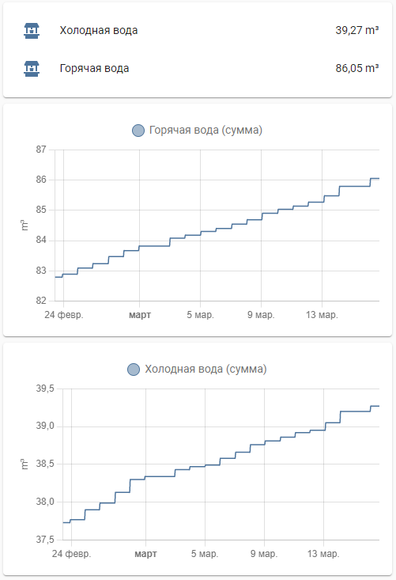

 OIOT облачный счетчик воды

**Разработчик данного компонента не имеет никакого отношения к компании OIOT**

Компонент для интеграции Home Assistant и системой сбора информации с водных счетчиков компании OIOT

Компонент использует [API](https://oiot.ru/api/) сайта, для работы

Информация для подключения доступна в [личном кабинете](https://oiot.ru/personal/controllers/api.php)

Наименования счетчиков и устройств подгружаются из личного кабинета.